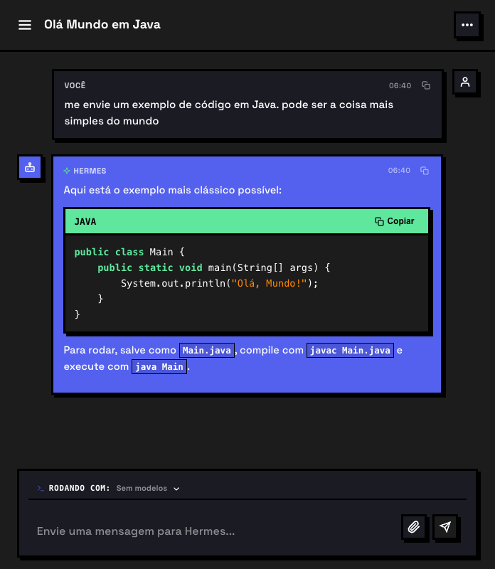
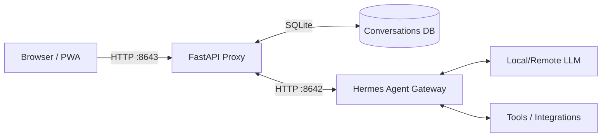

<div align="center">
  
  <h1>Hermes Chat UI</h1>
  <p>A modern, feature-rich web interface for <a href="https://github.com/NousResearch/hermes-agent">Hermes Agent</a>.</p>

  <p>
    <a href="https://github.com/lukegskw/hermes-chat-ui/pkgs/container/hermes-chat-ui"></a>
    <a href="https://github.com/NousResearch/hermes-agent"></a>
    <a href="https://github.com/lukegskw/hermes-chat-ui/blob/main/LICENSE"></a>
  </p>
</div>

## Overview

<div align="center">
  
</div>

## Oh no, another chat UI? Why did I build this?

Hermes Chat UI is a standalone web application designed to provide a rich chat interface for the Hermes Agent.

While there are existing community web UIs for Hermes Agent, many of them require a local installation on the host machine or don't support containerized deployments out of the box. **This project solves that by packaging the entire stack — agent, API proxy, and web UI — into a single Docker image.** This makes it trivial to deploy on a Synology NAS, Ugreen NAS, Portainer, or any standard Docker host.
With this setup, I can run the entire system on my UGREEN NAS and am now able to access it from anywhere via [Tailscale](https://tailscale.com/) (though it's also accessible on the local network).

> [!IMPORTANT]  
> **No Extra Installation of `hermes-agent` Needed!** The official `hermes-agent` is fully packaged inside this Docker image. You do not need to install or run the agent separately. However, because the agent runs internally, any specific agent configuration (like local LLMs, tools, or memory systems) must be configured by you via environment variables or volume mounts, as detailed in the [official Hermes Agent documentation](https://github.com/NousResearch/hermes-agent).

## Features

- **Progressive Web App (PWA)**: Installable on desktop and mobile.
- **Mobile First**: Fully responsive design that works beautifully on your phone.
- **Real-time Streaming**: Watch the agent's thought process and responses stream in real-time.
- **Tool Approval UI**: Safely review and approve/deny tool execution requests directly from the chat.
- **Context Compression**: Explicit support for context compression to manage long conversations.
- **Conversation Persistence**: All chats are automatically saved to a local SQLite database.
- **Model Switching**: Easily switch between available models from the sidebar.
- **Internationalization (i18n)**: Interface available in English and Portuguese (auto-detected).
- **Neo-Brutalist Design**: A unique, high-contrast visual style with hard shadows.

---

## Quick Start (Docker)

The easiest way to run Hermes Chat UI is using Docker Compose.

1. Download the template configurations:

```bash
curl -o docker-compose.example.yml https://raw.githubusercontent.com/lukegskw/hermes-chat-ui/main/docker-compose.example.yml
curl -o .env.example https://raw.githubusercontent.com/lukegskw/hermes-chat-ui/main/.env.example
```

2. Create your local config files:

```bash
cp docker-compose.example.yml docker-compose.yml
cp .env.example .env
```

3. **IMPORTANT:** Edit `.env` and set your `API_SERVER_KEY`.

4. Start the container:

```bash
docker compose up -d
```

3. Open your browser and navigate to `http://localhost:8643`.

---

## Configuration Reference

The application can be configured via environment variables.

### Core Settings

| Variable         | Description                                          | Default |
| ---------------- | ---------------------------------------------------- | ------- |
| `BACKEND_PORT`   | Port for the native Hermes Agent API                 | `8642`  |
| `PROXY_PORT`     | Port for the Web UI and augmented API                | `8643`  |
| `HERMES_API_KEY` | **REQUIRED**. Secure key shared between UI and Agent | _None_  |

### Built-in API Server

| Variable                | Description                                               | Default   |
| ----------------------- | --------------------------------------------------------- | --------- |
| `API_SERVER_ENABLED`    | Enable the OpenAI-compatible API server                   | `true`    |
| `API_SERVER_KEY`        | Secure key for the API (usually same as `HERMES_API_KEY`) | _None_    |
| `API_SERVER_HOST`       | Host address to bind the API server                       | `0.0.0.0` |
| `API_SERVER_PORT`       | Port for the API server                                   | `8642`    |
| `API_SERVER_MODEL_NAME` | Default model name to report via API                      | _None_    |

### Integrations (Optional)

| Variable       | Description                                                  | Default |
| -------------- | ------------------------------------------------------------ | ------- |
| `HA_URL`       | Home Assistant URL (e.g., `http://homeassistant.local:8123`) | _None_  |
| `HA_TOKEN`     | Home Assistant Long-Lived Access Token                       | _None_  |
| `GITHUB_TOKEN` | GitHub Personal Access Token                                 | _None_  |

---

## Architecture



The Docker image contains everything needed to run the app. It starts the Hermes Agent Gateway in the background, waits for it to become healthy, and then launches a lightweight FastAPI proxy. The proxy serves the compiled React application and augments the native API with conversation persistence.

---

## Local Development

Prerequisites:

- Node.js 20+
- Python 3.11+
- [uv](https://github.com/astral-sh/uv) package manager

1. Clone the repository:

```bash
git clone https://github.com/lukegskw/hermes-chat-ui.git
cd hermes-chat-ui
```

2. Set up your environment:

```bash
cp .env.example .env
# Edit .env and set your API keys
```

3. Install frontend dependencies:

```bash
npm install
```

4. Start the frontend development server:

```bash
npm run dev
```

5. (In a separate terminal) Start the backend proxy:

```bash
cd backend
# Create a venv and install dependencies based on your agent setup
uv run uvicorn main:app --host 0.0.0.0 --port 8643 --reload
```

---

## Contributing

Contributions are welcome! Please ensure you:

- Follow the existing Neo-brutalist design system.
- Maintain strict TypeScript type safety (no `any`, no implicit typing).
- Test UI changes in both English and Portuguese.

## License

This project is licensed under the MIT License - see the [LICENSE](LICENSE) file for details.
