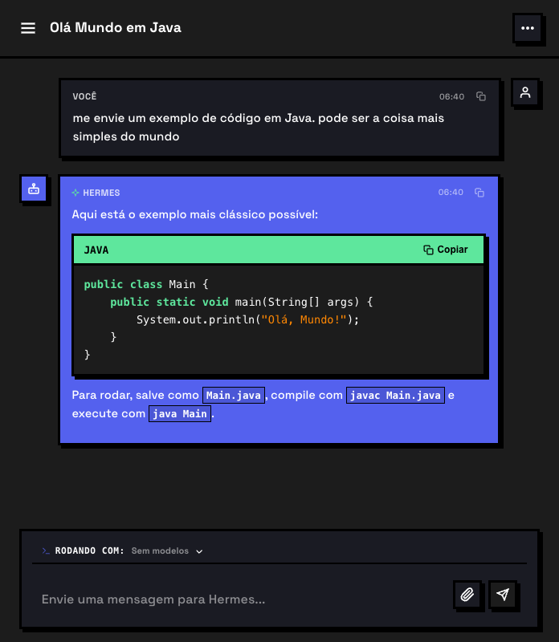

<div align="center">
  
  <h1>Hermes Chat UI</h1>
  <p>Use the Hermes Agent on your NAS or server from your phone and browser.</p>
  <p>
    <a href="https://github.com/lukegskw/hermes-chat-ui/pkgs/container/hermes-chat-ui">Docker image</a> ·
    <a href="docs/mobile.md">Phone setup</a> ·
    <a href="docs/demo.md">Try the workflow</a> ·
    <a href="LICENSE">MIT license</a>
  </p>
</div>

Send a task, leave the app, and return to the conversation from a completion
notification. Hermes Chat UI is a self-hosted web/PWA client for one trusted
user, with the same session history as the [official Hermes Agent](https://github.com/NousResearch/hermes-agent).

The agent runs in its own container or existing installation. The UI connects
to its official API; it does not install a modified Hermes runtime.

<div align="center">
  
</div>

## What you can do

- Install the PWA on desktop or mobile and use a responsive chat interface.
- Follow streamed answers, reasoning, and tool activity.
- Send multiple images and reopen them after refreshing or restarting the UI.
- Browse Hermes sessions from the UI, CLI, dashboard, cron, and other integrations.
- Pin and rename chats, choose a model per session, and load older history in pages.
- Leave the browser while a response runs, then receive Web Push and reopen that chat.

Completion notifications require permission, HTTPS on your phone, and all UI
windows to be in the background. UI and Hermes processes must remain running;
a container restart can interrupt an unfinished response. See [phone setup](docs/mobile.md).

## Start with your existing Hermes

You need Docker Compose v2 and a working Hermes API with the session and model
capabilities listed in [compatibility](docs/installation.md#compatibility).
The published image currently targets **Linux amd64**. For an ARM host, use the
[source build](docs/installation.md#build-from-source) unless the selected
published tag advertises your architecture.

Run these commands on the machine that will host the UI:

```bash
mkdir hermes-chat-ui-deploy
cd hermes-chat-ui-deploy
curl -fSLo docker-compose.ui.yml https://raw.githubusercontent.com/lukegskw/hermes-chat-ui/main/docker-compose.ui.example.yml
curl -fSLo .env https://raw.githubusercontent.com/lukegskw/hermes-chat-ui/main/.env.example
chmod 600 .env
```

Edit `.env`: set `API_SERVER_KEY` to your **existing Hermes API key** and
`HERMES_API_URL` to a URL reachable from the UI container.

If Hermes already runs in Docker, join both services to a shared network. For
example, with a Hermes container named `hermes-agent`:

```bash
docker network inspect hermes-internal >/dev/null 2>&1 || docker network create hermes-internal
# Only needed if the Hermes container is not already on this network:
docker network connect hermes-internal hermes-agent
```

With that container name, the default `HERMES_API_URL=http://hermes-agent:8642`
is correct. Ensure its API is enabled, bound to `0.0.0.0` **inside the container**,
and uses the same key. Add the external network to your Hermes Compose as shown
in the [installation guide](docs/installation.md#existing-hermes-in-docker)
so the connection survives container recreation.

Start the UI using the published image; no source checkout or local build is needed:

```bash
docker compose -f docker-compose.ui.yml pull
docker compose -f docker-compose.ui.yml up -d
```

Open **http://localhost:8643 on the Docker host**, send a message, and confirm
that you can reopen its conversation. If Docker runs on a NAS or remote server,
continue with [HTTPS access from your phone or laptop](docs/mobile.md).

- **No Hermes yet?** Follow [new Hermes installation](docs/installation.md#new-hermes-installation).
- **Hermes runs outside Docker or on another host?** See [connection options](docs/installation.md#hermes-outside-docker).
- **Connection failed?** Run the [read-only connection check](docs/installation.md#check-the-connection).
- **Already installed an older example?** Read [upgrade existing deployments](docs/installation.md#upgrade-existing-deployments) before replacing mounts.

## Try the everyday workflow

1. Open the installed PWA and submit a task that takes long enough to leave the app.
2. Put the app in the background; Hermes continues while the server processes stay running.
3. Tap the completion notification to reopen the same conversation.
4. Open the UI on your computer and find the conversation in Hermes history.

The [demo walkthrough](docs/demo.md) includes a sample prompt and a short feedback
checklist. It is a workflow to try on your installation, not a claim of verified
push delivery on every phone.

## Data and access

The examples bind host ports to `127.0.0.1`. The UI has **no built-in login or
multi-user isolation**. Use private access such as the [Tailscale Serve guide](docs/mobile.md)
or an authenticated reverse proxy with TLS. Anyone allowed to access the UI
can use the agent and read or delete its sessions; dashboard credentials do not
protect the UI.

Hermes owns the session database. **Deleting a conversation here permanently
deletes the canonical Hermes session**, including its history in other clients.
The UI volume stores image attachments, push keys/subscriptions, and proactive
request records. Keep both Hermes data and UI data when upgrading.

Self-hosting the interface does not make model or tool requests local. Web Push
also uses the browser/OS push service. See [architecture and advanced operation](docs/advanced.md)
for storage, media limits, optional configuration, and proactive automation.

## Local development

Prerequisites: Node.js 24, pnpm 11.25.0 (pinned in `package.json`), and a compatible
Hermes API.

```bash
corepack enable
pnpm install --frozen-lockfile --ignore-scripts
pnpm run dev
```

In another terminal:

```bash
API_SERVER_KEY=your-key \
HERMES_API_URL=http://127.0.0.1:8642 \
HERMES_PROXY_PORT=8643 \
HERMES_UI_DATA_DIR=./hermes-ui.local \
pnpm run dev:server
```

Vite connects to the BFF on port `8643`. Before submitting changes, run:

```bash
pnpm lint
pnpm type-check
pnpm test
pnpm build
```

Contributions are welcome. Preserve TypeScript safety, check UI changes in
English and Portuguese, and keep Hermes as the only session source of truth.

Licensed under the [MIT License](LICENSE).
