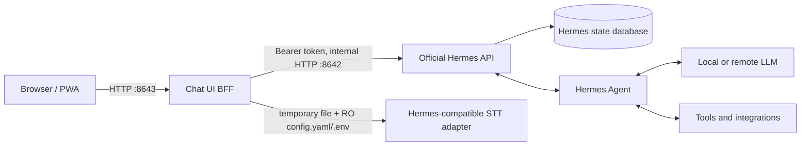

<div align="center">
  
  <h1>Hermes Chat UI</h1>
  <p>A self-hosted web UI for <a href="https://github.com/NousResearch/hermes-agent">Hermes Agent</a>, packaged for Docker and NAS deployments.</p>

  <p>
    <a href="https://github.com/lukegskw/hermes-chat-ui/pkgs/container/hermes-chat-ui"></a>
    <a href="https://github.com/NousResearch/hermes-agent"></a>
    <a href="https://github.com/lukegskw/hermes-chat-ui/blob/main/LICENSE"></a>
  </p>
</div>

## Why this project exists

Hermes Chat UI provides a customizable interface that can run entirely on private infrastructure. It is deployed separately from the official Hermes Agent image: Hermes owns the runtime, tools, dashboard and canonical session data; this project owns the web/PWA and a minimal browser-facing backend.

The original deployment runs on a UGREEN NAS and is accessed through [Tailscale](https://tailscale.com/). That private-network model is also the recommended way to run the project.

<div align="center">
  
</div>

## Features

- Installable Progressive Web App for desktop and mobile.
- Responsive, mobile-first interface.
- Real-time answer, reasoning, and tool-activity streaming.
- Multiple inline images, automatically resized and compressed before they are sent through the Hermes Sessions API.
- Voice-message recording in the web app and PWA. Hermes transcribes the recording, the UI places the resulting text in the composer for review, and only an explicitly sent transcript reaches the session.
- Model selection and per-session model persistence.
- English and Brazilian Portuguese interfaces.
- Canonical Hermes history: sessions created by this UI, the CLI, dashboard, cron, and other integrations appear together.
- Paginated session list suitable for long-lived installations.
- Background completion and Web Push support.

## Session data and deletion

Hermes Agent is the only source of truth for sessions and messages. The UI uses the official Hermes Sessions API and does not maintain a second chat database or access Hermes SQLite tables directly.

This has two important consequences:

1. A session created outside this UI is visible here.
2. Deleting a session here permanently deletes the canonical Hermes session, so it disappears from the CLI, dashboard, cron, and every other Hermes interface.

Bulk deletion is intentionally unavailable.

Versions of Hermes Chat UI before this architecture stored UI conversations in `/opt/data/hermes_chats.db`. That file is no longer opened and is not migrated automatically. An upgrade leaves the file untouched for manual recovery or rollback.

> [!IMPORTANT]
> Back up the `/opt/data` volume before upgrading. Hermes owns its current session database and schema migrations.

## Architecture


```mermaid
graph LR
    Browser[Browser / PWA] -->|HTTP :8643| Proxy[Chat UI BFF]
    Proxy -->|Bearer token, internal HTTP :8642| API[Official Hermes API]
    Proxy -->|temporary file + RO config.yaml/.env| STT[Hermes-compatible STT adapter]
    API --> DB[(Hermes state database)]
    API <--> Agent[Hermes Agent]
    Agent <--> LLM[Local or remote LLM]
    Agent <--> Tools[Tools and integrations]
```

The browser communicates only with the proxy on the UI origin. The proxy injects `API_SERVER_KEY` server-side, so the Hermes bearer token is never included in browser JavaScript. At startup, the UI checks `/v1/capabilities` and requires Hermes session resources, session chat, and streaming support. There is no legacy database fallback.

### Voice messages and media limits

The backend calls the same Hermes STT compatibility path used by Hermes voice features. The browser records locally, uploads one temporary audio file for transcription, and the proxy deletes that file immediately after success or failure. Audio is never attached to a Hermes session or written to the app's database. A successful transcript is appended to the current composer draft for review and editing; the user must send it explicitly as a normal chat message.

There is no duration limit in the UI, but a recording must be at most 25 MiB. A recording that exceeds this limit is stopped and must be recorded again. If transcription or network delivery fails, the browser keeps the audio in memory only long enough to offer a retry; closing or reloading the app discards it.

Images are compressed as a group. The final request is kept below the Hermes API's approximately 10 MB request limit. If all selected images cannot fit after compression, the UI sends none of them and keeps the draft intact.

Voice recording normally requires HTTPS (or a secure localhost origin), microphone permission, a browser with `MediaRecorder`, and a Hermes image that exposes its bundled STT dependencies. For a trusted private HTTP host, Chrome desktop can explicitly treat one origin as secure; see [Using voice on a private HTTP origin](#using-voice-on-a-private-http-origin). No application code bypasses the browser security model.

Hermes remains the single source of STT configuration. Provider, model, language,
and credentials are loaded server-side from the same `config.yaml` and `.env`
used by Hermes. Both are mounted into the UI container as individual read-only
files. The browser receives only the effective provider/model/language metadata;
it never receives `.env` contents. The UI image pins a compatibility package to
the tested Hermes release. The BFF imports only an allowlist of STT-related
variables from that file; unrelated integration credentials remain untouched.

#### NAS permissions for the read-only STT configuration

The UI image runs as UID `10001`. When the Hermes configuration directory is
not traversable/readable by that UID, grant the UI process only the minimum
read access it needs; this does **not** make the mount writable:

```bash
sudo setfacl -m u:10001:rx /volume2/docker_ssd/hermes/config
sudo setfacl -m u:10001:r /volume2/docker_ssd/hermes/config/config.yaml
sudo setfacl -m u:10001:r /volume2/docker_ssd/hermes/config/.env
```

Use the file-only read-only mount in the UI Compose:

```yaml
- /volume2/docker_ssd/hermes/config/config.yaml:/hermes-config/config.yaml:ro
- /volume2/docker_ssd/hermes/config/.env:/hermes-config/.env:ro
```

Confirm that `/volume2/docker_ssd/hermes/config/.env` exists before deploying
the UI stack; Docker may otherwise create a directory at a missing bind-mount
source. Repeat the file ACL command if Hermes replaces `config.yaml` or `.env`
during a configuration migration. Do not use `chmod 644` as a workaround: it
would make secrets readable by every local account.

## Quick start with Docker Compose

1. Download the examples:

```bash
curl -O https://raw.githubusercontent.com/lukegskw/hermes-chat-ui/main/docker-compose.hermes-agent.example.yml
curl -O https://raw.githubusercontent.com/lukegskw/hermes-chat-ui/main/docker-compose.ui.example.yml
curl -O https://raw.githubusercontent.com/lukegskw/hermes-chat-ui/main/.env.example
```

2. Create local configuration files:

```bash
cp docker-compose.hermes-agent.example.yml docker-compose.hermes-agent.yml
cp docker-compose.ui.example.yml docker-compose.ui.yml
cp .env.example .env
```

3. Edit `.env`. At minimum, replace `API_SERVER_KEY=changeme` with a strong random value and configure Hermes/model credentials according to the [official Hermes Agent documentation](https://github.com/NousResearch/hermes-agent).

   Before production, test the selected Hermes image without changing it:

   ```bash
   HERMES_CONTRACT_URL=http://your-nas:8642 \
   HERMES_CONTRACT_API_KEY="$API_SERVER_KEY" \
   .venv/bin/python scripts/check-hermes-contract.py
   ```

4. Start Hermes first. It creates the shared private Docker network:

```bash
docker compose -f docker-compose.hermes-agent.yml up -d
```

5. Start the UI separately:

```bash
docker compose -f docker-compose.ui.yml up -d --build
```

5. Open `http://localhost:8643`. The native Hermes dashboard is available at `http://localhost:9119` when enabled.

The two Compose files start independent containers joined only by the private
`hermes-internal` network. No file, plugin, startup hook, or project component
is added to `hermes-agent`; its existing `/opt/data` volume remains the
canonical state.

## Configuration

### Ports and API

| Variable                | Description                                                         | Default   |
| ----------------------- | ------------------------------------------------------------------- | --------- |
| `PROXY_PORT`            | Host port for the UI and FastAPI proxy                              | `8643`    |
| `BACKEND_PORT`          | Host port for the native Hermes API                                 | `8642`    |
| `DASHBOARD_PORT`        | Host and container port for the Hermes dashboard                    | `9119`    |
| `API_SERVER_ENABLED`    | Enable the Hermes native API; must remain enabled                   | `true`    |
| `API_SERVER_KEY`        | Required bearer key shared by Hermes and the UI BFF, never the browser | none      |
| `API_SERVER_HOST`       | Hermes API bind address inside the container                        | `0.0.0.0` |
| `API_SERVER_PORT`       | Hermes API port inside the container                                | `8642`    |
| `API_SERVER_MODEL_NAME` | Optional model name reported by the API                             | none      |

### Dashboard

| Variable                    | Description                         | Default |
| --------------------------- | ----------------------------------- | ------- |
| `HERMES_DASHBOARD`          | Enable the official Hermes dashboard | `1`     |
| `HERMES_DASHBOARD_BASIC_AUTH_USERNAME` | Dashboard username | none |
| `HERMES_DASHBOARD_BASIC_AUTH_PASSWORD` | Dashboard password | none |
| `HERMES_DASHBOARD_BASIC_AUTH_SECRET` | Stable dashboard auth secret | none |

### Speech-to-text

Configure voice transcription in `config.yaml`, the same file used by Hermes integrations such as Telegram and Discord. Recent Hermes versions default the global STT language hint to English. Set `language: ""` explicitly to detect the language independently for every recording:

```yaml
stt:
  enabled: true
  provider: openai
  language: ""
  openai:
    model: gpt-4o-transcribe
```

The OpenAI provider requires `VOICE_TOOLS_OPENAI_KEY` or `OPENAI_API_KEY` in the
Hermes `.env`. Because that file is mounted read-only into the BFF, the same key
is used without duplicating it in browser configuration. A fully local
configuration requires no API key and does not read `.env` or `auth.json`:

```yaml
stt:
  enabled: true
  provider: local
  language: ""
  local:
    model: small
```

Local model options include `tiny`, `base`, `small`, `medium`, and `large-v3`.
The UI image installs the official `hermes-agent[voice]` extra so the separate
BFF has the same `faster-whisper` runtime required by `provider: local`. Models
download into the persistent `/app/cache/huggingface` volume; the first
transcription can therefore take considerably longer. Larger models generally
improve short multilingual recordings but require more memory and processing
time. Other native Hermes STT providers and models can be configured in the
same file; consult the [Hermes Voice & TTS documentation](https://github.com/NousResearch/hermes-agent/blob/main/website/docs/user-guide/features/tts.md#voice-message-transcription-stt).

Ensure the cache bind mount is writable by the UI UID before the first local
transcription:

```bash
sudo setfacl -m u:10001:rwx /volume2/docker_ssd/hermes-chat-ui/cache
sudo setfacl -d -m u:10001:rwx /volume2/docker_ssd/hermes-chat-ui/cache
```

`GET /api/audio/capabilities` reports the resolved provider, model, and language
mode for diagnostics. It never returns provider credentials. For a credentialed
provider, if UID `10001` cannot read the mounted `.env`, voice is reported
unavailable and transcription returns `503 audio_configuration_unavailable`;
chat remains available. The local provider does not access that file.

### Optional integrations

| Variable              | Description                                             | Default                   |
| --------------------- | ------------------------------------------------------- | ------------------------- |
| `HASS_URL`            | Home Assistant URL                                      | none                      |
| `HASS_TOKEN`          | Home Assistant long-lived access token                  | none                      |
| `GITHUB_TOKEN`        | GitHub personal access token used by Hermes tools       | none                      |
| `VAPID_SUBJECT`       | Contact URI used for Web Push                           | `mailto:push@example.com` |
| `HERMES_PUSH_API_KEY` | Required dedicated bearer key for proactive-message endpoints | none                  |

### Proactive messages from Hermes

Proactive automation creates a new canonical Hermes conversation containing
the supplied final assistant text, then sends Web Push. The script talks to the
separate UI container over Docker DNS; `localhost:8643` is incorrect after the
split deployment, and dashboard port `9119` does not own the push route.

Generate a dedicated internal key:

```bash
openssl rand -hex 32
```

Set that value as `HERMES_PUSH_API_KEY` for both Compose projects. The UI also
receives the same dashboard username/password already configured for Hermes,
plus `HERMES_DASHBOARD_URL=http://hermes-agent:9119`. These credentials stay in
the BFF and are used only to call the official session-import operation; they
are never exposed to browser JavaScript.

Keep the caller script with the Hermes-managed skill or automation that owns
the notification. This repository intentionally does not install or maintain
that script. The only required integration contract is one authenticated
request to:

```text
http://hermes-chat-ui:8643/api/proactive/messages
```

Example from the Hermes container environment:

```bash
python3 /opt/data/skills/proactive-message/notify.py \
  "Backup completed successfully." "NAS backup"
```

If session import fails, push is still attempted and its body explicitly says
that the conversation was not saved. Successful notifications link directly
to the newly imported Hermes session. The service worker persists that session
target before opening or focusing the PWA, so iOS can recover it after either a
suspended-app resume or a cold start. The UI keeps bounded request-id records in
`/app/data/proactive_requests.json` so an ordinary retry cannot duplicate a
completed import or push.

## Security

This project is designed for one trusted user on a private network. The UI proxy itself is not a multi-user authentication layer.

> [!WARNING]
> Do not expose ports `8642`, `8643`, or `9119` directly to the public internet. Use Tailscale, a VPN, or a properly configured authenticated reverse proxy with TLS. Set dashboard credentials whenever the dashboard is reachable by another machine.

Keep `.env` out of version control, use a strong `API_SERVER_KEY`, and restrict access to the Hermes `/opt/data` and UI `/app/data` volumes. The example pins an image digest candidate; validate its capability contract and pin the tested digest before production.

## Troubleshooting

### “Sessions API unavailable”

The bundled or externally configured Hermes instance is too old or does not advertise the required capability flags. Update Hermes; this UI does not fall back to its former database.

### Sessions are missing

Confirm that the UI proxy and the CLI/dashboard use the same `/opt/data` volume. The UI requests sessions from every source and includes child sessions. Use “Load more” when more than 50 sessions exist.

### `401` or `403` from Hermes

Confirm that `API_SERVER_KEY` is set once in `.env` and passed to the container. The browser should never be configured with this key.

### The UI cannot reach Hermes

Check container logs and verify that `API_SERVER_ENABLED=true` and `API_SERVER_PORT` matches the container-side API port. In the split Compose topology the UI connects to `http://hermes-agent:8642` on the private Docker network.

### `Stored system prompt ... is null`

This warning is emitted by Hermes itself, not by the UI BFF. A session row has
messages but no cached assembled system prompt, so Hermes rebuilds that prompt,
continues the turn, and attempts to persist it with `update_system_prompt`.
The immediate effect is a prefix-cache miss for that turn, not lost chat
history. The UI sends every message in a chat to the same canonical session and
does not write Hermes' internal assembled prompt.

One warning when an older session is first resumed can therefore self-heal. If
the same session ID warns on every turn, inspect adjacent Hermes logs for
`Session DB update_system_prompt failed`; that indicates an upstream database
write/path problem. This client deliberately does not patch that private field
or add code to the official Hermes container.

### Voice messages are unavailable

Confirm that `HERMES_STT_PACKAGE` matches the tested Hermes release and that the same STT provider configuration is visible through the read-only config mount. Chat continues to work without voice support; an incompatible adapter disables only the microphone.

For `stt.provider: local`, the package must include the `voice` extra, for
example `HERMES_STT_PACKAGE=hermes-agent[voice]==0.19.0`. A package without that
extra does not contain `faster-whisper` and cannot run the local provider.

If the UI logs `failed to parse /hermes-config/auth.json` together with a
permission error, the file is not necessarily corrupt. Hermes 0.19 emits that
message when its managed-auth fallback cannot read the file. The UI adapter
loads an allowlist of direct STT credentials from the mounted `.env` before
that fallback runs. For example, OpenAI STT requires a non-empty
`VOICE_TOOLS_OPENAI_KEY` or `OPENAI_API_KEY` there. Rebuild the UI image after
updating this project; do not grant the UI write access to `auth.json` merely
to suppress the warning. With an explicit `stt.provider: local`, the adapter
does not inspect either credentials file.

### Voice messages are transcribed as English

Check `/opt/data/config.yaml`. Current Hermes defaults `stt.language` to `"en"`, which forces an English hint even when the recording uses another language. Set the global value to an empty string and restart the container:

```yaml
stt:
  language: ""
```

Confirm the effective configuration with `GET /api/audio/capabilities`; its `stt.language` value should be `"auto"`.

### Using voice on a private HTTP origin

Microphone capture normally requires a secure origin. For Chrome desktop only, a trusted private origin can be explicitly allowed for local testing or a private-network deployment:

1. Open `chrome://flags/#unsafely-treat-insecure-origin-as-secure`.
2. Enable the flag and add the exact origin, including scheme and port, for example `http://hermes-nas:8643`.
3. Relaunch Chrome using the button shown on the flags page.
4. Reload the UI and grant microphone permission when prompted.

The value must match the URL in the address bar exactly. If needed, run `window.isSecureContext` and `navigator.mediaDevices` in DevTools to confirm that Chrome accepted the origin.

> [!WARNING]
> This flag weakens Chrome's normal protection for the listed origin. Use it only for a host you control on a trusted private network. It is a per-browser setting, is not deployed by this app, and is not a general substitute for HTTPS.

### A voice recording is too large

The technical upload cap is 25 MiB. Record a shorter or lower-quality message; the UI intentionally does not impose an arbitrary duration limit.

### The PWA badge does not appear on iPhone

Install the app on the Home Screen, allow notifications, and verify the iOS version supports Home Screen web-app badges. The app cannot override a system-level notification or badge preference.

## Local development

Prerequisites:

- Node.js 24
- Python 3.11 or newer
- [uv](https://github.com/astral-sh/uv)
- A current Hermes Agent API exposing the Sessions API

Install and start the frontend:

```bash
npm ci
npm run dev
```

In another terminal, create a Python environment and start the proxy:

```bash
uv venv .venv
uv pip install --python .venv/bin/python -r backend/requirements.txt
API_SERVER_KEY=your-key \
HERMES_API_URL=http://127.0.0.1:8642 \
HERMES_PROXY_PORT=8643 \
.venv/bin/python -m backend.main
```

The Vite app connects to the proxy on port `8643` during development. For backend tests, install `backend/requirements-dev.txt` in the same environment and run `.venv/bin/python -m pytest backend/tests`. Run `npm run test`, `npm run type-check`, `npm run lint`, and `npm run build` before submitting a change.

## Contributing

Contributions are welcome. Please preserve strict TypeScript safety, test UI changes in English and Portuguese, and avoid adding a second session persistence path.

## License

Licensed under the MIT License. See [LICENSE](LICENSE).
