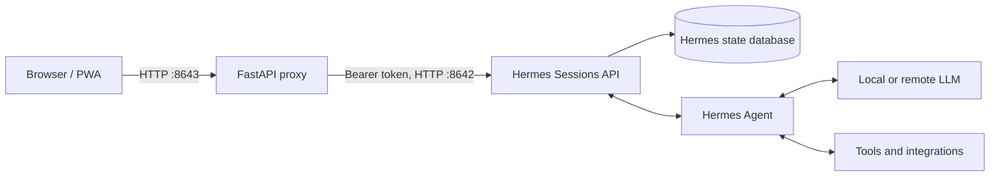

<div align="center">
  
  <h1>Hermes Chat UI</h1>
  <p>A self-hosted web UI for <a href="https://github.com/NousResearch/hermes-agent">Hermes Agent</a>, packaged for Docker and NAS deployments.</p>

  <p>
    <a href="https://github.com/lukegskw/hermes-chat-ui/pkgs/container/hermes-chat-ui"></a>
    <a href="https://github.com/NousResearch/hermes-agent"></a>
    <a href="https://github.com/lukegskw/hermes-chat-ui/blob/main/LICENSE"></a>
  </p>
</div>

## Why this project exists

Hermes Chat UI provides a customizable interface that can run entirely on private infrastructure. The Docker image includes Hermes Agent, the UI, and a small server-side proxy, so it works well on UGREEN, Synology, Portainer, or any standard Docker host without a separate Hermes installation.

The original deployment runs on a UGREEN NAS and is accessed through [Tailscale](https://tailscale.com/). That private-network model is also the recommended way to run the project.

<div align="center">
  
</div>

## Features

- Installable Progressive Web App for desktop and mobile.
- Responsive, mobile-first interface.
- Real-time answer, reasoning, and tool-activity streaming.
- Inline image input supported by the Hermes Sessions API.
- Model selection and per-session model persistence.
- English and Brazilian Portuguese interfaces.
- Canonical Hermes history: sessions created by this UI, the CLI, dashboard, cron, and other integrations appear together.
- Paginated session list suitable for long-lived installations.
- Background completion and Web Push support.

## Session data and deletion

Hermes Agent is the only source of truth for sessions and messages. The UI uses the official Hermes Sessions API and does not maintain a second chat database or access Hermes SQLite tables directly.

This has two important consequences:

1. A session created outside this UI is visible here.
2. Deleting a session here permanently deletes the canonical Hermes session, so it disappears from the CLI, dashboard, cron, and every other Hermes interface.

Bulk deletion is intentionally unavailable.

Versions of Hermes Chat UI before this architecture stored UI conversations in `/opt/data/hermes_chats.db`. That file is no longer opened and is not migrated automatically. An upgrade leaves the file untouched for manual recovery or rollback.

> [!IMPORTANT]
> Back up the `/opt/data` volume before upgrading. Hermes owns its current session database and schema migrations.

## Architecture


```mermaid
graph LR
    Browser[Browser / PWA] -->|HTTP :8643| Proxy[FastAPI proxy]
    Proxy -->|Bearer token, HTTP :8642| API[Hermes Sessions API]
    API --> DB[(Hermes state database)]
    API <--> Agent[Hermes Agent]
    Agent <--> LLM[Local or remote LLM]
    Agent <--> Tools[Tools and integrations]
```

The browser communicates only with the proxy on the UI origin. The proxy injects `API_SERVER_KEY` server-side, so the Hermes bearer token is never included in browser JavaScript. At startup, the UI checks `/v1/capabilities` and requires Hermes session resources, session chat, and streaming support. There is no legacy database fallback.

## Quick start with Docker Compose

1. Download the examples:

```bash
curl -O https://raw.githubusercontent.com/lukegskw/hermes-chat-ui/main/docker-compose.example.yml
curl -O https://raw.githubusercontent.com/lukegskw/hermes-chat-ui/main/.env.example
```

2. Create local configuration files:

```bash
cp docker-compose.example.yml docker-compose.yml
cp .env.example .env
```

3. Edit `.env`. At minimum, replace `API_SERVER_KEY=changeme` with a strong random value and configure Hermes/model credentials according to the [official Hermes Agent documentation](https://github.com/NousResearch/hermes-agent).

4. Start the container:

```bash
docker compose up -d
```

5. Open `http://localhost:8643`. The native Hermes dashboard is available at `http://localhost:9119` when enabled.

No separate `hermes-agent` installation is required. Configuration and persistent state live in the mounted `/opt/data` volume.

## Configuration

### Ports and API

| Variable                | Description                                                         | Default   |
| ----------------------- | ------------------------------------------------------------------- | --------- |
| `PROXY_PORT`            | Host port for the UI and FastAPI proxy                              | `8643`    |
| `BACKEND_PORT`          | Host port for the native Hermes API                                 | `8642`    |
| `DASHBOARD_PORT`        | Host and container port for the Hermes dashboard                    | `9119`    |
| `API_SERVER_ENABLED`    | Enable the Hermes native API; must remain enabled                   | `true`    |
| `API_SERVER_KEY`        | Required bearer key shared only by Hermes and the server-side proxy | none      |
| `API_SERVER_HOST`       | Hermes API bind address inside the container                        | `0.0.0.0` |
| `API_SERVER_PORT`       | Hermes API port inside the container                                | `8642`    |
| `API_SERVER_MODEL_NAME` | Optional model name reported by the API                             | none      |

### Dashboard

| Variable                    | Description                         | Default |
| --------------------------- | ----------------------------------- | ------- |
| `HERMES_DASHBOARD`          | Enable the bundled Hermes dashboard | `1`     |
| `HERMES_DASHBOARD_USER`     | Dashboard username                  | none    |
| `HERMES_DASHBOARD_PASSWORD` | Dashboard password                  | none    |

### Optional integrations

| Variable              | Description                                             | Default                   |
| --------------------- | ------------------------------------------------------- | ------------------------- |
| `HA_URL`              | Home Assistant URL                                      | none                      |
| `HA_TOKEN`            | Home Assistant long-lived access token                  | none                      |
| `GITHUB_TOKEN`        | GitHub personal access token used by Hermes tools       | none                      |
| `VAPID_SUBJECT`       | Contact URI used for Web Push                           | `mailto:push@example.com` |
| `HERMES_PUSH_API_KEY` | Optional bearer key for the internal push-send endpoint | none                      |

## Security

This project is designed for one trusted user on a private network. The UI proxy itself is not a multi-user authentication layer.

> [!WARNING]
> Do not expose ports `8642`, `8643`, or `9119` directly to the public internet. Use Tailscale, a VPN, or a properly configured authenticated reverse proxy with TLS. Set dashboard credentials whenever the dashboard is reachable by another machine.

Keep `.env` out of version control, use a strong `API_SERVER_KEY`, and restrict access to the persisted `/opt/data` directory. The example Compose file deliberately tracks the moving `:latest` application tag; pin a release tag yourself if you prefer controlled upgrades.

## Troubleshooting

### “Sessions API unavailable”

The bundled or externally configured Hermes instance is too old or does not advertise the required capability flags. Update Hermes; this UI does not fall back to its former database.

### Sessions are missing

Confirm that the UI proxy and the CLI/dashboard use the same `/opt/data` volume. The UI requests sessions from every source and includes child sessions. Use “Load more” when more than 50 sessions exist.

### `401` or `403` from Hermes

Confirm that `API_SERVER_KEY` is set once in `.env` and passed to the container. The browser should never be configured with this key.

### The UI cannot reach Hermes

Check container logs and verify that `API_SERVER_ENABLED=true` and `API_SERVER_PORT` matches the container-side API port. The proxy defaults to `http://localhost:8642` inside the all-in-one image.

## Local development

Prerequisites:

- Node.js 24
- Python 3.11 or newer
- [uv](https://github.com/astral-sh/uv)
- A current Hermes Agent API exposing the Sessions API

Install and start the frontend:

```bash
npm ci
npm run dev
```

In another terminal, create a Python environment and start the proxy:

```bash
uv venv .venv
uv pip install --python .venv/bin/python -r backend/requirements.txt
API_SERVER_KEY=your-key \
HERMES_API_URL=http://127.0.0.1:8642 \
HERMES_PROXY_PORT=8643 \
.venv/bin/python -m backend.main
```

The Vite app connects to the proxy on port `8643` during development. Run `npm run test`, `npm run type-check`, `npm run lint`, and `npm run build` before submitting a change.

## Contributing

Contributions are welcome. Please preserve strict TypeScript safety, test UI changes in English and Portuguese, and avoid adding a second session persistence path.

## License

Licensed under the MIT License. See [LICENSE](LICENSE).
