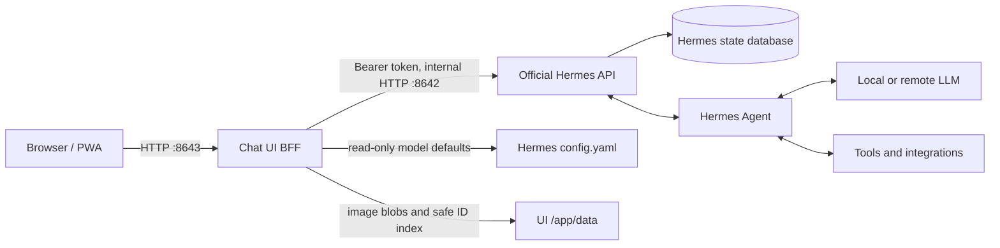

# Architecture and advanced operation

[Back to the README](../README.md) · [Installation](installation.md) · [Phone access](mobile.md)

## Session data and deletion

Hermes Agent is the only source of truth for sessions and messages. The UI uses the official Hermes Sessions API and does not maintain a second chat database or access Hermes SQLite tables directly. Because Hermes may omit submitted image data from persisted history, the UI keeps only its own image blobs and a message-ID association index under `/app/data/attachments`.

This has two important consequences:

1. A session created outside this UI is visible here.
2. Deleting a session here permanently deletes the canonical Hermes session, so it disappears from the CLI, dashboard, cron, and every other Hermes interface. After Hermes confirms the deletion, the UI also removes that session's locally retained images.

Bulk deletion is intentionally unavailable.

## Architecture



The browser communicates only with the proxy on the UI origin. The proxy injects `API_SERVER_KEY` server-side, so the Hermes bearer token is never included in browser JavaScript. When connecting, the browser checks `/v1/capabilities` and requires Hermes session resources, session chat, and streaming support.

The read-only configuration mount is optional. Without it, chat still works, but
the UI cannot display reasoning defaults from your local `config.yaml` and shows
provider defaults instead. See the [optional overlay](installation.md#optional-model-default-configuration).

### Media limits

Images are compressed as a group. The final request is kept below the Hermes API's approximately 10 MB request limit. If all selected images cannot fit after compression, the UI sends none of them and keeps the draft intact. Images sent after this feature is deployed are copied into the mounted UI `/app/data` volume; already-lost historical images cannot be recovered.

### Permissions for an optional configuration mount

The UI runs as UID `10001`. If you enable the file-only read-only overlay, that
UID needs permission to traverse the host directories and read `config.yaml`.
Use your NAS permissions interface or a narrowly scoped ACL for that UID. Do not
make the whole Hermes directory world-readable: it also contains credentials.
Reapply the file permission if Hermes replaces `config.yaml` during an upgrade.

### Proactive messages from Hermes

Proactive automation creates a new canonical Hermes conversation containing
the supplied final assistant text, then sends Web Push. The script talks to the
separate UI container over Docker DNS. Generate a dedicated internal key:

```bash
openssl rand -hex 32
```

Set that value as `HERMES_PUSH_API_KEY` for both Compose projects. Set
`HERMES_DASHBOARD=1`, configure dashboard authentication, and set
`HERMES_DASHBOARD_URL=http://hermes-agent:9119` in the UI environment. Recreate
the affected containers after updating these settings. The UI also
receives the same dashboard username/password already configured for Hermes.
These credentials stay in
the BFF and are used only to call the official session-import operation; they
are never exposed to browser JavaScript.

Keep the caller script with the Hermes-managed skill or automation that owns
the notification. This repository intentionally does not install or maintain
that script. The only required integration contract is one authenticated
request to:

```text
http://hermes-chat-ui:8643/api/proactive/messages
```

Send an `Authorization: Bearer <HERMES_PUSH_API_KEY>` header and a JSON body:

```json
{
  "request_id": "backup-2026-09-05-001",
  "title": "NAS backup",
  "message": "Backup completed successfully."
}
```

Use a new `request_id` for each event and reuse it for retries of that event.
The ID accepts letters, digits, `_`, `.`, `:`, and `-` (up to 128 characters).
Your own automation supplies the final text; this endpoint does not run a model.

If session import fails, push is still attempted and its body explicitly says
that the conversation was not saved. Successful notifications link directly
to the newly imported Hermes session. The service worker persists that session
target before opening or focusing the PWA, so iOS can recover it after either a
suspended-app resume or a cold start. The UI keeps bounded request-id records in
`/app/data/proactive_requests.json` so an ordinary retry cannot duplicate a
completed import or push.

## Troubleshooting

### “Sessions API unavailable”

The bundled or externally configured Hermes instance is too old or does not advertise the required capability flags. Update Hermes; this UI does not fall back to its former database.

### Sessions are missing

Confirm that the UI API URL points to the Hermes instance used by your CLI/dashboard. The UI does not mount `/opt/data`. The UI requests sessions from every source and includes child sessions. Use “Load more” when more than 50 sessions exist.

### `401` or `403` from Hermes

Confirm that `API_SERVER_KEY` is set once in `.env` and passed to the container. The browser should never be configured with this key.

### The UI cannot reach Hermes

Check container logs and verify that `API_SERVER_ENABLED=true` and `API_SERVER_PORT` matches the container-side API port. In the split Compose topology the UI connects to `http://hermes-agent:8642` on the private Docker network.

### `Stored system prompt ... is null`

This warning is emitted by Hermes itself, not by the UI BFF. A session row has
messages but no cached assembled system prompt, so Hermes rebuilds that prompt,
continues the turn, and attempts to persist it with `update_system_prompt`.
The immediate effect is a prefix-cache miss for that turn, not lost chat
history. The UI sends every message in a chat to the same canonical session and
does not write Hermes' internal assembled prompt.

One warning when an older session is first resumed can therefore self-heal. If
the same session ID warns on every turn, inspect adjacent Hermes logs for
`Session DB update_system_prompt failed`; that indicates an upstream database
write/path problem. This client deliberately does not patch that private field
or add code to the official Hermes container.

### The PWA badge does not appear on iPhone

Install the app on the Home Screen, allow notifications, and verify the iOS version supports Home Screen web-app badges. The app cannot override a system-level notification or badge preference.
