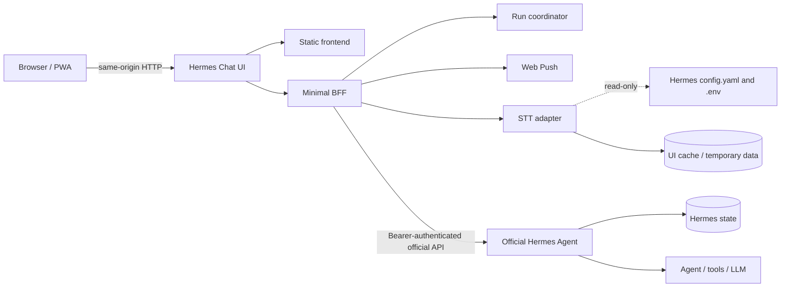

# Hermes Chat UI as a Client of Hermes Agent

Status: validated design  
Date: 2026-08-09

## Purpose

Separate Hermes Chat UI from the Hermes Agent runtime. Hermes Agent runs in an
unmodified official container and remains the source of truth for sessions,
messages, configuration, model routing, and agent execution. Hermes Chat UI
runs in its own container with only the frontend and the small server-side
capabilities required by the browser experience.

This document is a design decision, not an implementation plan.

## Understanding summary

- Hermes Agent and Hermes Chat UI must be deployed as separate services.
- The Hermes service must use the official image without plugins, scripts, or
  code supplied by this project.
- The UI keeps a minimal backend for API-key protection, STT, Web Push, and
  transient run coordination.
- Provider, model, and reasoning are selectable per conversation. Provider
  credentials and global defaults remain managed by the official dashboard.
- New conversations resolve the global Hermes provider/model pair at creation,
  or use the UI-local pair selected for future conversations.
- Runs continue after browser refresh, PWA closure, or UI-backend restart. A UI
  restart recovers canonical state, but does not promise replay of deltas emitted
  while the backend was unavailable.
- The reasoning panel exists as soon as generation begins, is collapsed by
  default, and receives Hermes reasoning events while the run is active.

## Constraints and assumptions

- Deployment is for one trusted user on a private network or VPN.
- A recent Hermes version with sessions, model options, model lock, runs, run
  status, run events, approvals, and cancellation is required.
- The Hermes API bearer key must not be exposed to browser JavaScript.
- Hermes remains the only permanent store for sessions and messages.
- The UI may keep bounded operational data for active runs, push subscriptions,
  client presence, and notification idempotency. This is not chat persistence.
- Typical scale is one active chat and one active transcription, on a NAS.
- Voice transcription must use the same provider, model, language, and
  credentials configured for Hermes.
- The UI STT adapter may temporarily depend on the version-pinned Hermes Python
  `voice` extra because the official API currently advertises no audio API.
  This supplies `faster-whisper` when Hermes is configured for local STT.
- The Hermes configuration is mounted into the UI container read-only. STT
  cache and temporary files belong to the UI container.

## Architecture



### Hermes Agent service

The Hermes service owns:

- the official gateway and API server;
- sessions and canonical message history;
- agent execution, tools, workspace, and integrations;
- global provider/model/reasoning configuration;
- provider credentials and the official dashboard.

Nothing from this repository is installed or mounted into that container.

### Hermes Chat UI service

The UI service owns:

- the compiled SPA/PWA;
- a restricted same-origin BFF that injects the Hermes bearer key;
- transient coordination and snapshots for active runs;
- Web Push subscriptions, client presence, and delivery idempotency;
- audio upload validation and the temporary Hermes-compatible STT adapter.

The BFF exposes only operations required by the UI. It is not a general-purpose
arbitrary HTTP proxy.

## Provider, model, and reasoning

The UI uses `GET /api/model/options` as its sole provider/model catalog. It
must not read `config.yaml` or construct a second model registry.

The composer exposes two runtime controls:

```text
Provider-grouped Model -> Reasoning
```

- The model selector groups authenticated models under their providers and
  stores the selected provider/model pair atomically.
- The BFF augments the catalog with the reasoning levels exported by its
  version-pinned Hermes compatibility package, intersected with the installed
  Sessions API parser. Hermes 0.19 predates that parser export, so the BFF uses
  the documented conservative current Sessions contract (`minimal` through
  `xhigh`) only in that compatibility case. The browser never carries a fixed
  fallback list.
- Reasoning is always represented in the composer. It is interactive only when
  both the catalog capability and its compatible levels are available;
  otherwise it stays visible but disabled with an explanatory label.
- The empty reasoning choice displays the effective Hermes default for the
  selected model (`agent.reasoning_overrides` before `agent.reasoning_effort`),
  or states that the provider default applies when Hermes has no override.
- Provider secrets are never returned to the browser.

The sidebar contains one provider-grouped model selector for new conversations.
Its initial visual choice is the Hermes global default. At session creation,
the client resolves that default to its concrete provider/model pair and sends
the pair atomically with `require_model_lock: true`. A user-selected future
model follows the same path. This mirrors Hermes' rule that global model changes
apply to new sessions while an existing session retains its runtime. It never
writes Hermes global configuration. The composer uses the same grouped selector
for the current conversation and persists changes with
`POST /api/sessions/{session_id}/model`.

### Session runtime identity

Provider and model form one routing identity; neither is valid as independent
client state. Hermes intentionally excludes the provider and `model_config`
from its public session representation, so the browser preserves a
backend-confirmed pair locally when reconciling session-list updates. It never
combines a model received later with a previously selected provider.

The virtual API model names `default` and `hermes-agent` mean “use the gateway
runtime” and must not be sent to an upstream provider as concrete model IDs.
Legacy UI sessions containing those sentinels are displayed with the current
concrete Hermes default. Their next turn confirms that concrete pair as the
session lock. If a browser does not know both provider and model, it sends
neither and lets Hermes use the persisted lock.

## Run and event flow

1. The frontend creates an optimistic user message and an empty assistant turn.
2. The assistant turn immediately contains a collapsed reasoning panel and a
   general generating state.
3. The BFF accepts an idempotent client request and creates a Hermes run.
4. The BFF stores a bounded operational record containing the session ID, run
   ID, status, confirmed runtime, and consolidated display snapshot.
5. One BFF consumer reads Hermes run events and updates the snapshot.
6. Browsers receive the current snapshot followed by new events. A refresh does
   not create another Hermes run.
7. On a terminal event, the BFF reconciles with canonical Hermes messages,
   updates notification state, and eventually expires operational data.

Event mapping:

| Hermes event                                | UI state                     |
| ------------------------------------------- | ---------------------------- |
| `run.started`                               | Run active                   |
| `reasoning.available`                       | Reasoning content            |
| `tool.started`, progress, completed, failed | Agent activity               |
| `message.delta`                             | Assistant response text      |
| `approval.request`                          | Pending approval interaction |
| completed, failed, cancelled                | Terminal run state           |

The activity panel appears only after a tool event. If the model emits no
reasoning, the empty temporary reasoning panel is removed when the run finishes.

### Reconnection semantics

- Browser or PWA disconnect: reconnect to the BFF snapshot and ongoing events.
- UI backend restart: Hermes continues the detached run; the BFF polls run
  status and reconciles with canonical session messages.
- Events emitted while the BFF is down are not replayed unless Hermes adds an
  official replay/cursor contract. The UI does not synthesize missing deltas.
- Hermes restart or expired run: mark the optimistic turn interrupted and
  reconcile any canonical messages that exist.

## Root cause of the current reasoning bug

The current stream parser handles `assistant.delta` and tool events but only
looks for reasoning inside `run.completed.messages`. Current Hermes session
streaming surfaces reasoning as a progress event and does not guarantee that
final array. The live assistant message therefore has no `reasoning_content`.

After refresh, the history normalizer reads persisted `reasoning` or
`reasoning_content`, which explains why the panel becomes visible then. The new
event reducer treats reasoning as first-class live run state and does not depend
on final-message recovery to render its panel.

## STT boundary

The Hermes container remains untouched. Until Hermes exposes an official audio
API, the UI container carries a version-pinned compatibility adapter for the
Hermes STT code path. The image installs `hermes-agent[voice]` rather than the
base package so explicit `provider: local` configurations do not fall through
when `faster-whisper` is absent.

- The browser uploads at most one bounded recording to the UI BFF.
- The BFF writes a temporary file, transcribes it, and deletes it on every exit
  path.
- `config.yaml` and `.env` are mounted as individual read-only files from the
  Hermes data directory. The BFF can therefore use the same effective STT
  settings and, for credentialed providers, credentials without duplicating
  them in browser configuration. Local STT does not read credential files.
- Local models use the UI-owned `/app/cache/huggingface` volume; the immutable
  image filesystem remains read-only.
- Compatibility is checked at startup. Failure disables only voice and reports
  a specific diagnostic; chat remains usable.

This dependency should be replaced by the official Hermes audio API if one is
introduced later.

## Web Push

The UI backend stores subscriptions, VAPID configuration, client presence, and
a terminal-notification marker keyed by run ID. On completion it reconciles the
canonical response, suppresses notifications while a visible client is active,
and atomically records delivery intent to prevent duplicates.

After restart, non-terminal operational records are checked against Hermes run
status so background completion notifications are still delivered.

## Current Hermes run transport gate

Implementation inspection of the current Hermes API found that `/v1/runs`
does not persist its turns into the Sessions API. The UI therefore keeps
`/api/sessions/{id}/chat/stream` as its production chat transport: it is the
only current endpoint that preserves canonical session history, image content,
and the browser model lock together. A bounded run coordinator remains a future
design option, but is intentionally absent from the production BFF until a
Hermes contract test proves that a run submitted with `session_id` writes the
same canonical messages as session chat.

This is a compatibility gate, not a second data store or Hermes modification.
It means browser-close continuity is preserved by the detached BFF relay, but
an UI-backend restart cannot claim lossless run continuation yet. The UI
reconciles canonical messages when it reconnects.

## Security

- The browser talks only to the UI origin.
- The Hermes bearer key exists only in the UI backend environment.
- The BFF allowlists Hermes operations and applies request-size limits.
- Provider credentials never pass through catalog responses or UI state.
- The Hermes API port should remain on the internal container network when
  direct host access is unnecessary.
- Dashboard access remains protected by its Hermes authentication and the
  private-network/reverse-proxy boundary.
- Audio configuration is read-only; temporary recordings are always deleted.

## Failure behavior

- One active run is permitted per session.
- Client request IDs make submission retries idempotent.
- Runtime controls are locked while a session is generating.
- A failed model lock restores the last confirmed UI selection.
- Browser/BFF stream reconnect uses bounded backoff.
- Cancel calls the official run stop endpoint and then reconciles history.
- Deleting an active session stops its run before canonical deletion.
- Pending approvals are restored from the operational snapshot/status.
- Unknown runs after a Hermes restart are marked interrupted, not completed.
- Notification delivery is idempotent by run ID.
- Operational snapshots coalesce deltas and have bounded size and retention.

## Testing strategy

1. Unit-test the frontend event reducer, including reasoning before, between,
   and after tool calls.
2. Test the BFF against a fake Hermes for idempotent submission, disconnects,
   restart recovery, approval, cancellation, and push delivery.
3. Run contract tests against the minimum supported real Hermes release.
4. Run browser tests for refresh, multiple tabs, PWA navigation, images, voice,
   provider/model/reasoning changes, and active-run deletion.
5. Keep a regression test for the reported bug: reasoning arrives before final
   text, the panel already exists collapsed, and refresh preserves the state.
6. Keep runtime-routing regressions for duplicate model IDs across providers,
   session-list reconciliation, virtual model sentinels, and atomic model locks.

## Decision log

### 2026-08-11 — Atomic provider/model identity

- **Decision:** resolve the Hermes global provider/model pair and persist a
  confirmed model lock when every UI-created session starts.
- **Decision:** preserve the last backend-confirmed provider/model pair across
  public session-list reconciliation because Hermes omits provider metadata.
- **Decision:** fail visibly and keep the previous selection when a model-lock
  update fails.
- **Alternatives rejected:** sending model/provider on every turn without a
  confirmed lock permits races; maintaining a second BFF session database
  creates another source of truth.
- **Reason:** the Hermes Sessions API already owns durable locks, while the
  browser only needs enough local metadata to display the provider that the
  client-safe session representation intentionally omits.

## Alternatives considered

### Wait for official event replay

This is the only way to guarantee lossless event replay across UI-backend
restart without adding code to Hermes. It was rejected as the immediate path
because canonical recovery is acceptable and a recent Hermes runs API is
available.

### Keep the current attached session-stream relay

This preserves the existing implementation shape but keeps execution coupled to
the UI process and does not satisfy restart recovery. Rejected.

### Browser talks directly to Hermes

This removes the BFF but exposes the bearer key to JavaScript and loses the
current STT and Web Push boundaries. Rejected.

## Decision log

| Decision                                                                  | Alternatives                                                    | Reason                                                                                                                                                                      |
| ------------------------------------------------------------------------- | --------------------------------------------------------------- | --------------------------------------------------------------------------------------------------------------------------------------------------------------------------- |
| Separate Hermes and UI containers                                         | Unified wrapper image                                           | Hermes should be independently deployable and upgradeable.                                                                                                                  |
| Keep a minimal BFF                                                        | Static browser-only client                                      | Preserve bearer-key secrecy, voice, and Web Push.                                                                                                                           |
| Leave Hermes container unmodified                                         | Hermes-side plugin                                              | The official service must contain no project-specific additions.                                                                                                            |
| Use the Hermes catalog and model lock APIs                                | Maintain a UI model registry                                    | Avoid duplicated provider knowledge and credentials.                                                                                                                        |
| Use hybrid provider administration                                        | Rebuild dashboard auth/setup                                    | Keep per-session controls in chat and global administration in Hermes.                                                                                                      |
| New-session model selector is UI-local                                    | Write Hermes global defaults                                    | The sidebar affects only future sessions from this browser and never mutates Hermes configuration.                                                                          |
| Initial new-session choice displays Hermes default                        | Always reuse a browser preference                               | The current global pair is resolved and locked at creation, matching Hermes' new-session semantics without writing global configuration.                                     |
| Treat provider/model as one atomic runtime identity                       | Reconcile or send model independently                           | Model IDs can exist under multiple providers; a bare model can be routed through the wrong global provider.                                                                 |
| Derive reasoning levels from UI compatibility package and Sessions parser | Fixed browser list; invent a model registry                     | Avoid frontend drift while the Hermes public catalog lacks per-model effort values; use a conservative API-contract fallback only for the older 0.19 compatibility package. |
| Reuse one select-field component in sidebar and composer                  | Separate ad-hoc select styles                                   | Keep labels, focus state, arrow affordance, and disabled state visually consistent.                                                                                         |
| Group the shared model selector by provider                               | Separate provider selector; repeat provider in every model name | Providers remain visible without consuming a second control, while each selected value still carries the exact provider/model pair.                                         |
| Keep reasoning visible when unavailable                                   | Hide the control                                                | Make unsupported models and incomplete catalogs diagnosable in the UI.                                                                                                      |
| Show the effective default in the empty reasoning option                  | Generic “Padrão do Hermes” label                                | Make the no-override choice understandable without exposing configuration or secrets.                                                                                       |
| Gate detached runs on canonical-session persistence                       | Use runs unconditionally                                        | Current Hermes runs do not yet persist session turns, so history and images take priority.                                                                                  |
| Accept canonical recovery after BFF restart                               | Require lossless replay                                         | Current official events API has no replay cursor.                                                                                                                           |
| Show reasoning immediately but collapsed                                  | Wait for first reasoning chunk                                  | Stable UI and clear active state without forcing disclosure.                                                                                                                |
| Keep Hermes-compatible STT temporarily in UI                              | Separate STT configuration                                      | Preserve the exact Hermes STT configuration while leaving Hermes untouched.                                                                                                 |
| Target one trusted private-network user                                   | Multi-user tenancy                                              | Matches the deployment and avoids unnecessary identity/session isolation.                                                                                                   |

## Explicit non-goals

- Multi-user authentication or tenant isolation.
- Provider credential entry, OAuth, or global configuration editing.
- A second conversation database.
- Modifying or extending the official Hermes container.
- Supporting older Hermes versions without the required capability flags.
- Guaranteeing replay of events emitted while the UI backend is offline.
